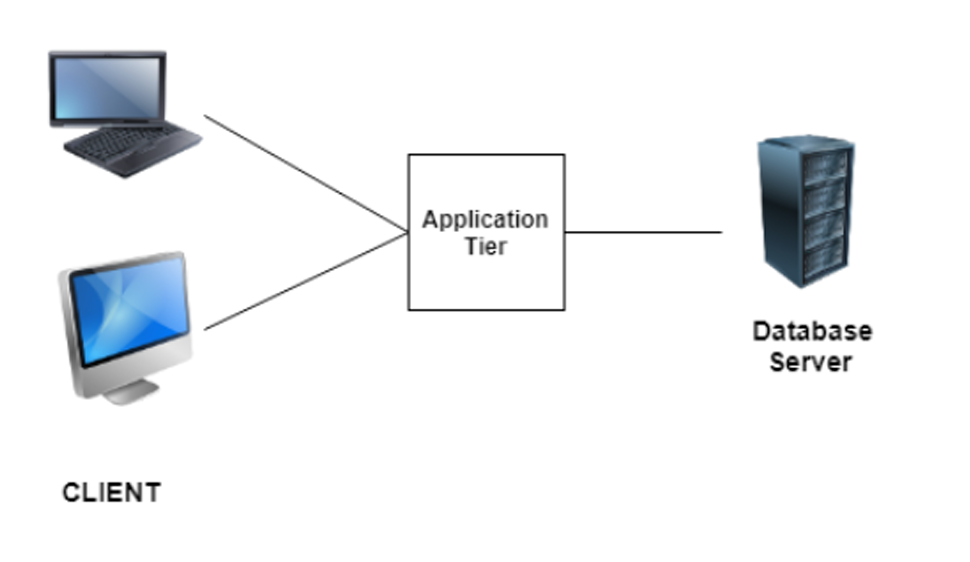

# 3-Tier / N-Tier Architecture

This project illustrates a typical 3-tier architecture commonly used in web applications.

## Layers

### 1. Client Layer
- Users interact with the application via browsers or mobile apps.
- Sends requests to the web server.

### 2. Web Server (Public Layer)
- Receives client requests and forwards them to the application server.
- Serves static content and can handle load balancing.
- Example: Nginx, Apache HTTP Server

### 3. Application Server (Private Layer)
- Hosts business logic and application code.
- Processes requests and communicates with the database server.
- Example: Tomcat, IIS
- Should not be exposed to the internet directly.

### 4. Database Server (Private Layer)
- Stores persistent application data.
- Example: MySQL, PostgreSQL
- Only accessible by the application server.

## Communication
- Devices communicate using **IP addresses** and **hostnames**.
- Data flow: Client → Web Server → Application Server ↔ Database Server

## Security Notes
- Keep application & database servers in private networks.
- Use firewalls to restrict direct internet access.

