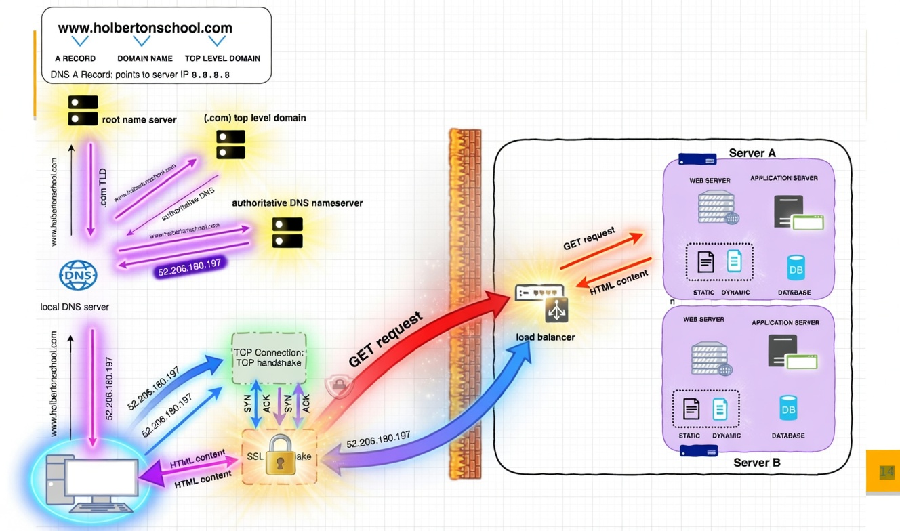

🌐 What is DNS?

DNS (Domain Name System) is used to convert:

Hostname → IP Address
IP Address → Hostname

Example:

google.com → 142.250.xxx.xxx

👉 DNS works like an internet phonebook

📍 DNS Resolution Flow (Step-by-Step)
Browser
User enters: google.com
Local DNS (/etc/hosts + ISP DNS)
Checks if IP already exists locally
Root Name Server (RNS)
Points to Top Level Domain (TLD)
TLD Server
Example: .com, .org, .in
Authoritative Name Server
Contains actual IP (SOA record)
Response to Browser
IP is returned → Connection starts

🔄 DNS Flow Diagram (Easy Memory)

Browser → Local DNS → Root DNS → TLD → Authoritative DNS → IP → Browser

📦 Data Packets (Network)
Data is sent as packets (pkts)
Each packet contains:
Source IP
Destination IP
Data

🔥 Firewall

Controls incoming/outgoing traffic
Rules:
✅ Allow
❌ Deny

Example:

HTTP (Port 80) ❌ Blocked
HTTPS (Port 443) ✅ Allowed
⚖️ Load Balancer (LB)
Distributes traffic across multiple servers
Improves:
Performance
Availability
Scalability
🏗️ 3-Tier Architecture (Google Example)
1️⃣ Web Server
Handles client requests (UI layer)
2️⃣ Application Server
Processes business logic
Example: Google search logic
3️⃣ Database Server
Stores data
User → Web Server → App Server → DB Server
🔐 Common Ports
Protocol	Port	Purpose
HTTP	80	Not Secure
HTTPS	443	Secure
SSH	22	Linux Access
RDP	3389	Windows Access
🛠️ Useful Commands
🔍 nslookup

Used to find IP from domain:

nslookup google.com
🧠 Key Points to Remember
DNS = Converts domain ↔ IP
DNS is distributed (not one location)
Firewall = Security layer
Load Balancer = Traffic distribution
3-Tier = Web + App + DB
🚀 Real-Time Flow (Interview Answer)
1. User enters google.com
2. DNS resolves IP
3. Request goes via internet (packets)
4. Firewall checks rules
5. Load balancer distributes traffic
6. Web → App → DB
7. Response sent back to user

